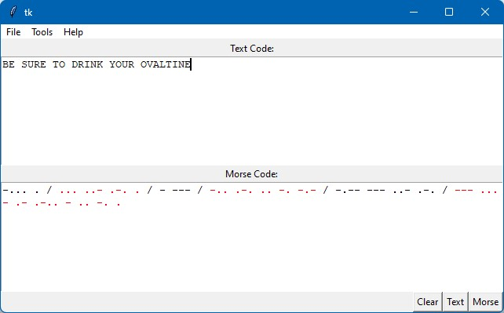

<!--
References:
 - https://github.com/othneildrew/Best-README-Template
-->

# Morris v1.0.6 [Stable]

  

## :book: About
Morris is designed to be a lightweight, intuitive, and feature rich Morse Code translation utility.
 
 

	<a href="https://github.com/Tomm-Smith/Morris/issues/new?labels=bug&template=bug-report---.md">Report Bug</a>
	<a href="https://github.com/Tomm-Smith/Morris/issues/new?labels=enhancement&template=feature-request---.md">Request Feature</a>

(<a href="#readme-top">back to top</a>)

## :triangular_ruler: Plans

- [x] Colorize Morse Code Output [#8](https://github.com/Tomm-Smith/Morris/issues/8)
- [ ] Colorize Options for Display [#10](https://github.com/Tomm-Smith/Morris/issues/10)
- [ ] Persistent Settings [#7](https://github.com/Tomm-Smith/Morris/issues/7)
- [ ] Dynamic Code Formatting [#6](https://github.com/Tomm-Smith/Morris/issues/6)
- [ ] Replay Audible Morse Code [#5](https://github.com/Tomm-Smith/Morris/issues/5)
- [ ] Menu Option for Rapid Alphabet Clear Text [#4](https://github.com/Tomm-Smith/Morris/issues/4)

(<a href="#readme-top">back to top</a>)

## :memo: License
Morris resides under the free canopy of the GPL v3. See [LICENSE](/LICENSE) for more information.

(<a href="#readme-top">back to top</a>)

## :beer: Author
Tom Smith - Thomas.Briggs.Smith@gmail.com

Project Link: [https://github.com/Tomm-Smith/Morris](https://github.com/Tomm-Smith/Morris)

(<a href="#readme-top">back to top</a>)
